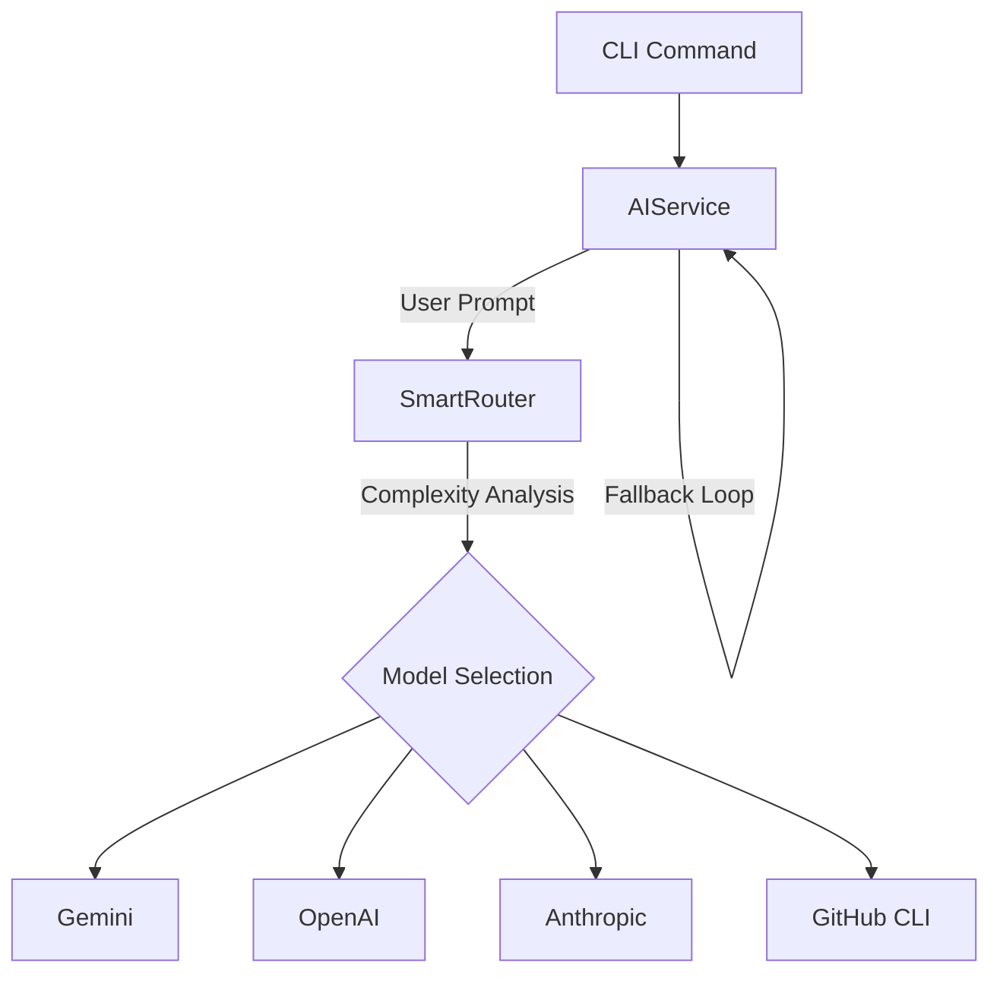

# Smart AI Router Documentation

**Version:** 2.0 (Python Implementation)
**Status:** Active

## Overview

The Smart AI Router is a Python-based intelligent request routing system embedded within the Agent CLI. It dynamically selects the most appropriate AI model based on complexity tiers, context window requirements, and provider priority configuration.

It serves as the decision engine logic inside `src/agent/core/router.py`, utilized by the `AIService` in `src/agent/core/ai/service.py`.

### Key Features

- **Tier-Based Routing**: Selects models based on task complexity ('light', 'standard', 'advanced').
- **Context Window Management**: Filters out models that cannot handle the estimated input token count.
- **Provider Priority**: Configurable priority list (e.g., prefer Gemini over OpenAI).
- **Cost Awareness**: selection logic factors in cost per 1k input tokens.
- **Failover**: The consuming `AIService` implements automatic fallback across providers (GH -> Gemini -> OpenAI -> Anthropic).

---

## Architecture

The router is integrated directly into the Python `agent` application.



### Components

1. **SmartRouter (`src/agent/core/router.py`)**:
    - Loads configuration from `.agent/etc/router.yaml`.
    - Estimates token counts.
    - Filters and sorts available models.
    - Returns the best matching model configuration.

2. **AIService (`src/agent/core/ai/service.py`)**:
    - Manages API clients (OpenAI, Google GenAI, Anthropic, GH CLI).
    - Executes the request using the routed model.
    - Handles retries and provider fallbacks.
    - Logs metrics (Prometheus).

---

## Configuration

The router is configured via YAML files in `.agent/etc/`.

### 1. Router Configuration (`.agent/etc/router.yaml`)

Defines the available models, their properties, and global routing settings.

```yaml
settings:
  default_tier: standard
  provider_priority:
    - gemini
    - openai
    - gh
    - anthropic

models:
  gemini-2.5-pro:
    provider: gemini
    tier: advanced
    context_window: 1048576
    cost_per_1k_input: 0.000125
  
  gpt-4o:
    provider: openai
    tier: advanced
    context_window: 128000
    cost_per_1k_input: 0.005

  gpt-4o-mini:
    provider: openai
    tier: light
    context_window: 128000
    cost_per_1k_input: 0.00015
```

### 2. Agent Configuration (`.agent/etc/agent.yaml`)

Can override the default provider for the agent instance.

```yaml
agent:
  provider: gemini  # Forces a specific provider, bypassing router logic if set
```

---

## Usage

The router is generally used transparently by the Agent CLI commands. However, you can interact with the AI components directly via CLI.

### Inspecting Models

To see which models are currently available/configured:

```bash
agent list-models
# OR for a specific provider
agent list-models gemini
```

### Specifying Models/Providers Manually

You can bypass the router logic by explicitly setting a provider or model in your commands (where supported):

```bash
# Force using the 'gh' (GitHub) provider
agent --provider gh <command>
```

---

## Troubleshooting

### Logs

The router logs detailed decision info (tier matching, cost analysis) to the agent logs.
Check `.agent/logs/` for details.

### Common Issues

1. **"No suitable models found"**:
    - Check if your input exceeds the `context_window` of available models.
    - Ensure your `router.yaml` has models defined for the requested Tier.

2. **Provider Errors**:
    - Use `agent secret list` to verify API keys are set.
    - Run `agent list-models <provider>` to verify connectivity.

---

## Development

- **Source Code**: `src/agent/core/router.py`
- **Tests**: To be added in `tests/core/test_router.py`.
