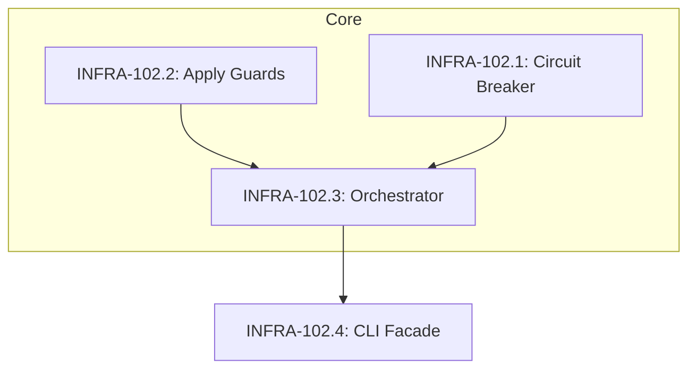

# INFRA-102: Implement Command Decomposition Plan

The implementation command is currently a 1,819 LOC monolith. This plan decomposes it into modular components across four child stories to satisfy the 500 LOC per-file constraint and improve testability.

## Child Stories

### 1. INFRA-102.1: Implement Circuit Breaker Module
**Status: TODO**  
**Estimated LOC: 250**  
Create `agent/core/implement/circuit_breaker.py` to handle LOC tracking and threshold enforcement (AC-3).
- Implement `CircuitBreaker` class to track cumulative `LOC_EDITED`.
- Constants: `MAX_EDIT_DISTANCE_PER_STEP`, `LOC_WARNING_THRESHOLD`, `LOC_CIRCUIT_BREAKER_THRESHOLD` (400).
- Logic for `should_halt()` and `generate_follow_up_story()`.
- **Negative Test**: Unit test verifying circuit breaker triggers at 400 LOC and generates a valid follow-up story ID.

### 2. INFRA-102.2: Implement Apply Guards and Docstring Enforcement
**Status: TODO**  
**Estimated LOC: 300**  
Implement the validation gates required by AC-9 and AC-10.
- Create `agent/core/implement/guards.py`.
- Implement `enforce_docstrings(filepath, content)` using `ast.parse()` to check module, class, and function/method docstrings (including inner functions).
- Implement `ApplyResult` dataclass to track `rejected_files` and violation details.
- Logic to reject full-file overwrites (safe-apply guard from INFRA-096).
- Unit tests for AST parsing and rejection scenarios.

### 3. INFRA-102.3: Implement Orchestrator Core
**Status: TODO**  
**Estimated LOC: 400**  
Extract the execution loop and block parsing from the monolith into `agent/core/implement/orchestrator.py` (AC-2).
- Migrate `parse_code_blocks`, `apply_code_blocks`, and the main step execution loop.
- Integrate `CircuitBreaker` (INFRA-102.1) and `guards.py` (INFRA-102.2).
- **Bug Fix**: Correct the `block_loc` uninitialised-variable bug where LOC leaked across loop iterations on failure.
- Implement the `⚠️ INCOMPLETE STEP` and `🚨 INCOMPLETE IMPLEMENTATION` terminal reporting logic (AC-9).
- Ensure OpenTelemetry spans are preserved.

### 4. INFRA-102.4: Implement CLI Facade and Integration
**Status: TODO**  
**Estimated LOC: 200**  
Finalize the refactor by thinning the CLI layer and ensuring compatibility (AC-1, AC-4, AC-5, AC-6).
- Reduce `agent/commands/implement.py` to a Typer facade that parses arguments and calls the `Orchestrator`.
- Create `agent/core/implement/__init__.py` to re-export the public API.
- Verify circular dependency check: `python -c "import agent.cli"`.
- **Regression**: Run existing `tests/commands/test_implement.py` to ensure zero breaking changes to the external CLI contract.

## Dependency Graph

## Review Plan

- **Module Boundary Check**: Ensure `core/implement/circuit_breaker.py` does not import from `commands/` to satisfy AC-6.
- **AST Correctness**: Verify the `ast.parse` logic in INFRA-102.2 correctly identifies missing docstrings in decorated methods and nested functions.
- **LOC Count**: Final verification that no file exceeds 500 LOC and no story PR exceeds 400 LOC.