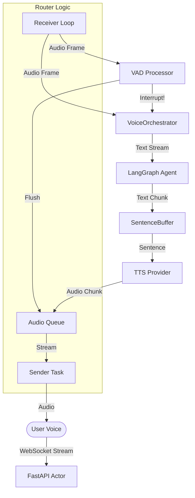

# Backend Voice Integration

## Overview

The backend voice integration provides a real-time, bidirectional voice pipeline capable of "barge-in" interactions. It orchestrates Speech-to-Text (STT), conversational AI (LangGraph), and Text-to-Speech (TTS) with ultra-low latency.

**Key Features**:

- **Real-Time Streaming**: Asynchronous Generator architecture for sub-second responses.
- **Barge-In Interrupts**: Voice Activity Detection (VAD) stops the agent immediately when the user speaks.
- **Natural Prosody**: uses `SentenceBuffer` to group tokens into speech-friendly chunks.
- **Provider Agnostic**: Interfaces for Swappable STT/TTS (Deepgram, Local Kokoro, etc.).

- **Provider Agnostic**: Interfaces for Swappable STT/TTS (Deepgram, Local Kokoro, etc.).

### Installation

The voice module is optional. Install with:

```bash
pip install -e ".agent/[voice]"
```

## Architecture

### Component Flow



### Concurrent Router Pattern

To support "barge-in", the WebSocket endpoint uses a **Concurrent Actor Pattern** instead of a simple Request/Response loop.

1. **Sender Task**: A dedicated background task that consumes an `asyncio.Queue` and streams audio to the client.
2. **Receiver Loop**: The main loop reads input frames from the WebSocket.
3. **VAD Check**: Every input frame is checked for speech probability *synchronously* before processing.
4. **Interrupt Handling**: If speech is detected while the agent is speaking:
    - `orchestrator.interrupt()` is called (cancels TTS generation).
    - `audio_queue` is drained (prevents old audio from playing).
    - `{"type": "clear_buffer"}` control message is sent to client.

---

## Protocols

### WebSocket API

**Endpoint**: `ws://localhost:8000/ws/voice`

**Client Messages (Input)**:

- **Binary**: Raw audio bytes (16kHz, single channel, PCM16).

**Server Messages (Output)**:

- **Binary**: Audio response bytes (16kHz, PCM16).
- **JSON (Control)**:

  ```json
  {
    "type": "clear_buffer"
  }
  ```

  *Action Required*: Client MUST immediately stop audio playback and clear its local buffer.

---

## configuration

### Voice Activity Detection (VAD)

The system uses `silero-vad` (ONNX) via a `VADProcessor` wrapper.

**Behavior**:

- Models are downloaded automatically to `.agent/src/backend/voice/` on first run.
- If `onnxruntime` is missing, VAD is gracefully disabled (standard conversational mode).

### Tuning

Configure thresholds in `.agent/etc/voice.yaml`:

```yaml
stt:
  provider: deepgram
tts:
  provider: deepgram
whisper:
  model_size: tiny
```

### STT Provider Modes (Deepgram)

The system supports two distinct modes for Deepgram STT:

1. **`deepgram` (Default)**: Uses **HTTPS REST** (batch file API).
   - **How**: The backend accumulates ~1.5s of audio, adds a WAV header, and sends it as a single request.
   - **Pros**: Robust to network jitter, lower connection overhead, highly reliable.
   - **Cons**: Slightly higher latency (buffer accumulation time).

2. **`deepgram_streaming`**: Uses **WebSockets** (real-time stream).
   - **How**: Maintains a persistent WebSocket to Deepgram. Audio is pushed in small chunks as it arrives.
   - **Pros**: Lowest possible latency, real-time feedback.
   - **Cons**: Sensitive to network interruptions, higher resource usage for idle connections.

---

## Robustness & Error Handling

To ensure the agent remains usable even if voice services are misconfigured or unavailable, the system implements several safety layers:

### 1. Graceful Fallbacks (`DisabledSTT/TTS`)

If a provider fails to initialize (e.g., missing API key, library not installed), the `get_voice_providers` factory returns a `Disabled` instance. These instances fulfill the protocol but return empty results, preventing backend crashes.

### 2. Isolated Dependencies

Imports for heavy voice libraries (`deepgram-sdk`, `faster-whisper`, `kokoro-onnx`) are performed **locally** within the factory initialization blocks. This allows the backend to start even if these optional dependencies are missing from the environment.

### 3. VAD Resilience

VAD initialization is non-fatal. If the Silero model cannot be downloaded (404s or network timeout), the system warns the user and continues in standard "push-to-talk" style mode without interrupts.

---

## Usage Example

### Client (Python)

```python
import asyncio
import websockets
import json

async def run_client():
    async with websockets.connect("ws://localhost:8000/ws/voice") as ws:
        
        async def listen():
            while True:
                msg = await ws.recv()
                if isinstance(msg, bytes):
                    play_audio(msg)
                else:
                    data = json.loads(msg)
                    if data.get("type") == "clear_buffer":
                        stop_playback_immediately()
        
        asyncio.create_task(listen())
        
        # Stream microphone...
```

---

## Next Steps

### 1. Tool Integration (INFRA-036)

Equip the `VoiceOrchestrator` agent with tools (e.g. `lookup_documentation`, `check_status`) using the LangGraph tool-calling interface.

### 2. Multi-Provider Support (INFRA-037)

Add adapters for Google Cloud Speech and Azure Cognitive Services to `backend.speech.providers`.
