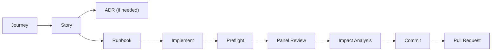

# Getting Started with Agent CLI

This guide walks you through the full story-driven development lifecycle — from installation through your first pull request.

## Prerequisites

- **Python 3.11+** and **pip**
- **Git** (repository management)
- **ShellCheck** (shell script linting)
- **Node.js & npm** (JavaScript/TypeScript linting)
- Optional: API keys for AI providers (Gemini, OpenAI, or Anthropic)

## Installation

### 1. Create Virtual Environment

```bash
cd /path/to/your/repo

python3 -m venv .venv
source .venv/bin/activate

# Standard install
pip install -e .agent/

# With voice support
pip install -e ".agent/[voice]"

# With ADK multi-agent governance panel
pip install -e ".agent/[adk]"

# Everything (voice + ADK + advanced AI)
pip install -e ".agent/[voice,adk,ai]"
```

### 2. Set Up AI Provider

Pick one:

**Google Gemini (Recommended)**

```bash
export GEMINI_API_KEY="your-api-key-here"
```

Get your key at [Google AI Studio](https://aistudio.google.com/apikey).

**OpenAI**

```bash
export OPENAI_API_KEY="your-api-key-here"
```

**GitHub CLI (Fallback — 8k context window)**

```bash
brew install gh && gh auth login
```

### 3. Verify

```bash
export PATH="$PATH:$(pwd)/.agent/bin"
agent --version
agent list-models   # confirm AI connectivity
```

## The Lifecycle

Every code change follows a structured path:



**Quality gates** at every stage: journey linking, story commitment, runbook acceptance, governance review, and automated preflight checks.

## Quick Start (5-Minute Path)

If you want to skip straight to building, here is the minimum viable flow — no journeys, no ADRs, no panel:

```bash
agent new-story                          # 1. Create story (INFRA/WEB/MOBILE/BACKEND)
# Edit the generated .md file, set State: COMMITTED
agent new-runbook WEB-001                # 2. Generate runbook
# Review, set Status: ACCEPTED
agent implement WEB-001                  # 3. AI-assisted implementation
agent preflight --story WEB-001          # 4. Run checks
agent commit --story WEB-001 --ai        # 5. Commit
agent pr --story WEB-001                 # 6. Create PR
```

For full governance compliance, keep reading.

---

## Step 1: Define User Journeys

Journeys describe **what your system does from a user's perspective**. They act as a behavioral contract — the agent reads them before writing code and avoids breaking existing behavior.

```bash
# Scaffold from template
agent new-journey JRN-001

# AI-generated from a brief description
agent new-journey JRN-001 --ai
```

This creates a YAML file in `.agent/cache/journeys/`:

```yaml
id: JRN-001
title: "User signs up and verifies email"
actor: "unauthenticated user"
description: "New user creates an account and verifies their email."
steps:
  - action: "User navigates to /signup"
    system_response: "Renders signup form"
    assertions:
      - "Signup form is visible"
  - action: "User submits email and password"
    system_response: "Creates account, sends verification email"
    assertions:
      - "HTTP 201 returned"
      - "Verification email sent"
```

Five required fields: `id`, `title`, `actor`, `description`, `steps`. Everything else is optional.

**Validate your journey:**

```bash
agent validate-journey
```

**List all journeys:**

```bash
agent list-journeys
```

> **Why journeys first?** Without them, the agent has no memory of existing behavior. When it implements a new story it may break something that was working. See [User Journeys](user_journeys.md) for the full reference and [Journey YAML Spec](journey_yaml_spec.md) for the schema.

---

## Step 2: Create a Story

Stories are the unit of work. Every code change must be traceable to a story.

```bash
agent new-story
```

You'll be prompted for scope (INFRA / WEB / MOBILE / BACKEND) and title. The CLI creates a file like `.agent/cache/stories/WEB/WEB-001-add-user-profile-page.md`.

**Fill in:**

- **Problem Statement** — what problem are we solving?
- **User Story** — As a [user], I want [capability] so that [value]
- **Acceptance Criteria** — specific, testable conditions
- **Test Strategy** — how will we verify this works?
- **Linked Journeys** — which JRN-IDs does this story implement?

**Set state to COMMITTED when ready:**

```markdown
## State
COMMITTED
```

**Other story commands:**

```bash
agent list-stories           # List all stories
agent validate-story WEB-001 # Validate schema
```

---

## Step 3: Create an ADR (If Needed)

Architectural Decision Records document significant design choices. Create one when introducing a new pattern, dependency, or architectural boundary.

```bash
agent new-adr
```

ADRs live in `.agent/adrs/` and follow the format:

```markdown
# ADR-NNN: Title

## State
ACCEPTED

## Context
Why this decision is needed.

## Decision
What we chose.

## Consequences
Trade-offs and implications.
```

> Not every story needs an ADR. Use them for choices future developers will ask "why?".

---

## Step 4: Generate a Runbook

Once the story is `COMMITTED`, generate an implementation plan:

```bash
agent new-runbook WEB-001
```

The AI will:

1. Read your story and any linked journeys
2. Load governance rules from `agents.yaml`
3. Generate a detailed implementation plan with files, steps, and compliance checklist

**Review and accept:**

```markdown
Status: ACCEPTED
```

Runbooks are saved in `.agent/cache/runbooks/WEB/WEB-001-runbook.md`.

---

## Step 5: Implement

### AI-Assisted

```bash
agent implement WEB-001
```

The AI reads the runbook, generates code, and creates or modifies files. **Always review AI-generated code.**

> Use `--skip-journey-check` for infrastructure stories that have no user-facing behavior.

### Manual

Just write the code yourself. The story and runbook are reference docs — you don't have to use AI implementation.

---

## Step 6: Run Preflight Checks

Preflight validates your changes against governance rules before commit.

```bash
# Basic checks (lint, tests, schema)
agent preflight --story WEB-001

# Full AI governance review
agent preflight --story WEB-001 --ai

# Interactive repair mode — auto-fix schema violations
agent preflight --story WEB-001 --ai --interactive

# Use ADK multi-agent panel engine
agent preflight --story WEB-001 --ai --panel-engine adk
```

**What preflight checks:**

- ✅ Linting (ShellCheck, ESLint, ruff)
- ✅ Tests pass
- ✅ Story schema valid
- ✅ Architecture compliance
- ✅ Security (no secrets/PII in code)
- ✅ Test coverage
- ✅ Documentation updates
- ✅ Scope-specific checks (Mobile/Web/Backend)

**Interactive repair** (`--interactive`) will propose AI-powered fixes for failures and ask for confirmation before applying them.

---

## Step 7: Convene the Governance Panel

For standalone governance review or design consultation:

```bash
# Review changes against a story
agent panel WEB-001

# Ask a design question
agent panel "Should we use WebSockets or SSE for real-time updates?"

# Auto-apply panel advice to the story
agent panel WEB-001 --apply

# Use ADK multi-agent engine
agent panel WEB-001 --panel-engine adk
```

The panel convenes role-based AI reviewers:

| Role | Focus |
| --- | --- |
| @Architect | System design, ADR compliance |
| @Security | SOC2, GDPR, secrets |
| @QA | Test coverage, reliability |
| @Product | Acceptance criteria, user value |
| @Docs | Documentation sync |
| @Compliance | Regulatory enforcement |
| + Scope-specific | @Mobile, @Web, or @Backend |

> The `--panel-engine adk` flag uses Google's Agent Development Kit for multi-agent orchestration. Falls back to the legacy sequential engine if ADK is unavailable. See [ADR-029](../adrs/ADR-029-adk-multi-agent-integration.md).

---

## Step 8: Impact Analysis

Before committing, understand the blast radius:

```bash
# Stage changes first
git add .

# Static analysis (AST-based dependency graph)
agent impact WEB-001

# AI-enhanced (risk assessment, breaking change detection)
agent impact WEB-001 --ai

# Write analysis back into the story
agent impact WEB-001 --ai --update-story
```

---

## Step 9: Commit

```bash
# Manual conventional commit
agent commit --story WEB-001

# AI-generated commit message
agent commit --story WEB-001 --ai
```

Commit format: `feat(web): add user profile page [WEB-001]`

---

## Step 10: Create a Pull Request

```bash
agent pr --story WEB-001

# Draft PR
agent pr --story WEB-001 --draft

# Open in browser
agent pr --story WEB-001 --web
```

The PR includes: story summary, acceptance criteria checklist, governance report, and test verification.

---

## Advanced Features

### Secret Management

Store API keys securely instead of using environment variables:

```bash
agent secret init                     # First-time setup
agent secret login                    # Store master password in keychain
agent secret import gemini            # Import from env vars
agent secret set openai api_key       # Set manually
```

See [ADR-006](../adrs/ADR-006-encrypted-secret-management.md).

### Artifact Synchronization

Sync stories, plans, and runbooks to Notion or Supabase:

```bash
agent sync pull                       # Pull from remote
agent sync push                       # Push to remote
agent sync status                     # View inventory
agent sync init --backend notion      # Bootstrap Notion workspace
```

### Admin Console

Visual dashboard for project management:

```bash
agent admin start                     # Launch (FastAPI + Vite/React)
agent admin status                    # Check if running
agent admin stop                      # Shut down
```

Opens at `localhost:8080` with the API at `localhost:8000`.

### Natural Language Query

Ask questions about your codebase:

```bash
agent query "Which files handle authentication?"
```

### Governance Audit

Full-repository traceability audit:

```bash
agent audit                           # Default 80% traceability threshold
agent audit --min-traceability 90     # Stricter
agent audit --output reports/q1.md    # Save report
```

---

## Command Quick Reference

### Lifecycle

| Command | Description |
| --- | --- |
| `agent new-journey [ID]` | Create a user journey |
| `agent new-story` | Create a story |
| `agent new-adr` | Create an Architectural Decision Record |
| `agent new-runbook <ID>` | Generate an implementation runbook |
| `agent new-plan` | Create an epic plan |
| `agent implement <ID>` | AI-assisted implementation |

### Quality & Governance

| Command | Description |
| --- | --- |
| `agent preflight` | Run governance checks |
| `agent panel [ID or question]` | Convene governance panel |
| `agent impact <ID>` | Run impact analysis |
| `agent audit` | Full repository audit |
| `agent validate-story <ID>` | Validate story schema |
| `agent validate-journey` | Validate journey YAML |
| `agent lint` | Run linters |

### Workflow

| Command | Description |
| --- | --- |
| `agent commit` | Commit with conventional message |
| `agent pr` | Create pull request |
| `agent match-story` | Match changes to a story |

### Listing

| Command | Description |
| --- | --- |
| `agent list-stories` | All stories |
| `agent list-runbooks` | All runbooks |
| `agent list-plans` | All plans |
| `agent list-journeys` | All journeys |
| `agent list-models` | Available AI models |

### Infrastructure

| Command | Description |
| --- | --- |
| `agent admin start/stop/status` | Admin console |
| `agent sync pull/push/status` | Artifact sync |
| `agent secret init/login/set/get` | Secret management |
| `agent config` | Configuration management |
| `agent query` | Natural language codebase query |
| `agent onboard` | Onboard new repository |
| `agent mcp` | MCP server management |

---

## Troubleshooting

### "Command not found: agent"

```bash
export PATH="$PATH:$(pwd)/.agent/bin"
```

### "Story file not found"

```bash
agent list-stories   # verify the story exists
```

### "AI returned empty response"

Check your API key:

```bash
echo $GEMINI_API_KEY    # or $OPENAI_API_KEY
agent list-models       # verify connectivity
```

### "Preflight failed"

Read the failure details. Common issues:

- Missing test coverage
- No CHANGELOG entry
- Undocumented API changes
- Security violations (PII, hardcoded secrets)

Use `--interactive` to auto-fix schema violations.

### "No journeys linked to this story"

Implementation is blocked. Either:

1. Create journeys with `agent new-journey` and link them in the story
2. Use `--skip-journey-check` for infrastructure stories

---

## Getting Help

```bash
agent --help                 # All commands
agent preflight --help       # Help for specific command
```

## Further Reading

- [Commands Reference](commands.md) — detailed options for every command
- [Governance System](governance.md) — how the AI review panel works
- [Workflows](workflows.md) — story-driven development patterns
- [User Journeys](user_journeys.md) — behavioral contracts
- [Journey YAML Spec](journey_yaml_spec.md) — journey schema reference

---

**Next**: [Commands Reference](commands.md) →
