# Governance System

Understanding the AI-powered governance panel and how it enforces quality standards.

## Overview

The Agent CLI replaces manual code reviews with a **systematic, AI-assisted governance process**. Think of it as having a full engineering team reviewing every change before it goes to production.

## The Governance Panel

The panel consists of **9 specialized AI agents**, each focusing on different aspects of software quality:

### Panel Members

| Role | Focus | Key Responsibilities |
|------|-------|---------------------|
| **👷 Architect** | System Design | ADR compliance, architectural boundaries, scalability |
| **🧪 QA** | Quality Assurance | Test coverage, testing strategies, bug prevention |
| **🔒 Security** | Security Posture | Secrets scanning, PII detection, vulnerabilities |
| **📊 Product** | User Value | Acceptance criteria, impact analysis, user stories |
| **📡 Observability** | System Health | Metrics, tracing (OpenTelemetry), logging standards |
| **📚 Docs** | Documentation | CHANGELOG, README, API docs synchronization |
| **⚖️ Compliance** | Regulatory | SOC2, GDPR enforcement, data handling |
| **📱 Mobile** | React Native | Expo patterns, offline-first, mobile UX |
| **🌐 Web** | Frontend | Next.js, SEO, accessibility, server components |
| **⚙️ Backend** | API/Services | FastAPI patterns, async/await, database migrations |

### Configuration

Panel members are defined in `.agent/etc/agents.yaml`:

```yaml
team:
  - role: architect
    name: "System Architect"
    description: "Guardian of system design, scalability, and ADR compliance."
    responsibilities:
      - "Review and approve ADRs"
      - "Enforce architectural boundaries"
    governance_checks:
      - "Do ADRs exist for major changes?"
      - "Are architectural boundaries respected?"
    instruction: "Consult .agent/instructions/architect/ for context"
```

## How Governance Works

### 1. Preflight Checks

When you run `agent preflight`, here's what happens:

```mermaid
graph TD
    A[Start Preflight] --> B[Load Story]
    B --> C[Get Git Diff]
    C --> D[Load Governance Rules]
    D --> E{Chunk Diff}
    E --> F[For Each Agent Role]
    F --> G[Load Role Instructions]
    G --> H[AI Review Chunk]
    H --> I{More Chunks?}
    I -->|Yes| H
    I -->|No| J{More Roles?}
    J -->|Yes| F
    J -->|No| K[Aggregate Results]
    K --> L{All Pass?}
    L -->|Yes| M[✅ Pass]
    L -->|No| N[❌ Fail]
```



### 2. Review Process

Each agent receives:

1. **Story content** - Requirements and acceptance criteria
2. **Code diff** - Actual changes being made
3. **Governance rules** - From `.agent/rules/*.mdc`
4. **Role instructions** - From `.agent/instructions/<role>/`

They evaluate and return:

- **Status**: PASS, WARNING, FAIL, BLOCKER
- **Feedback**: Specific issues found
- **Suggestions**: How to fix issues

### 3. Consensus Building

After all agents review:

1. Aggregate all feedback
2. Identify blockers (must fix)
3. Highlight warnings (should fix)
4. Generate unified report
5. Save to `.agent/logs/preflight-<timestamp>.log`

## Governance Rules

Rules are stored in `.agent/rules/` as Markdown Context (`.mdc`) files.

### Rule Types

#### 1. Global Rules (`100-main.mdc`)

Apply to all code changes:

```markdown
# Global Governance Rules

## Code Quality
- All public functions must have docstrings
- No commented-out code in production
- Maximum function length: 50 lines

## Security
- No hardcoded credentials
- No PII in logs
- All user input must be validated
```

#### 2. Compliance Rules

**SOC2** (`102-global-compliance-requirements.mdc`):

- Data encryption at rest and in transit
- Audit logging for sensitive operations
- Access control enforcement
- Security incident response procedures

**GDPR** (`.agent/compliance/GDPR.md`):

- Lawful basis for data processing
- User consent mechanisms
- Right to erasure implementation
- Data portability support

#### 3. Architectural Rules (`202-adr-standards.mdc`)

```markdown
# ADR Standards

## When to Create an ADR
- Database technology choices
- External API integrations
- Authentication/authorization patterns
- Major framework decisions

## ADR Format
Use the template in .agent/templates/adr-template.md

## Status Lifecycle
- **DEPRECATED**: Binding but no new uses allowed.
- **RETIRED**: Not binding, usage forbidden.
```

#### 4. Domain-Specific Rules

**Testing** (`500-test.mdc`):

- Unit test coverage > 80%
- Integration tests for all API endpoints
- E2E tests for critical user flows

**Documentation** (`501-documentation.mdc`):

- All API changes require OpenAPI updates
- Public modules require README
- Breaking changes need migration guide

**API Contracts** (`201-api-contract-validation.mdc`):

- OpenAPI spec must be valid
- No breaking changes without version bump
- Response schemas must match implementation

## Role-Specific Instructions

Instructions add context for specific roles, stored in `.agent/instructions/<role>/`.

### Example: QA Instructions

**File**: `.agent/instructions/qa/CRITICAL_FLOWS.md`

```markdown
# Critical User Flows

These flows MUST have E2E test coverage:

## Authentication
- User registration
- Login/logout
- Password reset
- Session expiration

## Data Operations
- Create record
- Read record
- Update record
- Delete record

## Payment Processing
- Add payment method
- Process payment
- Refund
- Subscription management
```

### Example: Compliance Instructions

**File**: `.agent/instructions/compliance/GDPR.md`

```markdown
# GDPR Compliance Checklist

## For Any User Data Collection
- [ ] Lawful basis documented
- [ ] User consent obtained
- [ ] Privacy policy updated
- [ ] Data retention period defined
- [ ] Deletion mechanism implemented

## For Third-Party Data Sharing
- [ ] Data Processing Agreement exists
- [ ] User informed of sharing
- [ ] Recipient's security validated
```

## State Enforcement

The agent enforces strict state transitions to ensure quality gates are respected.

### State Diagram

```text
Plan: PROPOSED → APPROVED
                    ↓
Story: DRAFT → IN_PROGRESS → COMMITTED
                         ↓
Runbook: PROPOSED → ACCEPTED
                       ↓
                 Implementation
```

### Enforcement Rules

Defined in `.agent/rules/203-state-enforcement.mdc`:

#### Rule 1: Plan Approval Required

- **Requirement**: Plan must be `APPROVED` before stories can be created
- **Enforced by**: `agent new-story` checks parent plan status
- **Rationale**: Ensures architectural alignment before work begins

#### Rule 2: Story Commitment Required

- **Requirement**: Story must be `COMMITTED` before runbook generation
- **Enforced by**: `agent new-runbook` checks story status
- **Rationale**: Requirements must be locked before implementation planning

#### Rule 3: Runbook Acceptance Required

- **Requirement**: Runbook must be `ACCEPTED` before implementation
- **Enforced by**: `agent implement` checks runbook status
- **Rationale**: Implementation plan must be reviewed before execution

### Checking State

States are validated during preflight:

```bash
agent preflight --story WEB-001
```

If story is not `COMMITTED`, preflight will fail:

```
❌ BLOCKER: Story WEB-001 must be in COMMITTED state
Current state: TO_DO
Update story state before proceeding.
```

## Review Criteria by Role

### @Architect Reviews

**Pass Criteria:**

- ✅ ADR exists for major architectural changes
- ✅ No cross-boundary violations (e.g., Mobile importing Backend)
- ✅ Follows established patterns

**Common Failures:**

- ❌ New database without ADR
- ❌ Direct database access from frontend
- ❌ Circular dependencies

### @Security Reviews

**Pass Criteria:**

- ✅ No secrets in code (use env vars)
- ✅ No PII in logs
- ✅ All inputs validated
- ✅ Dependencies have no known vulnerabilities

**Common Failures:**

- ❌ Hardcoded API keys
- ❌ `user.email` in log statements
- ❌ SQL injection vulnerabilities
- ❌ Outdated dependencies with CVEs

### @QA Reviews

**Pass Criteria:**

- ✅ Test strategy section complete
- ✅ Unit tests for new functions
- ✅ Integration tests for API changes
- ✅ E2E tests for critical flows

**Common Failures:**

- ❌ No tests for new feature
- ❌ Test strategy missing
- ❌ Existing tests broken

### @Product Reviews

**Pass Criteria:**

- ✅ Acceptance criteria clear and testable
- ✅ Impact analysis complete (Run `agent impact <ID>` to generate)
- ✅ User story follows template

**Common Failures:**

- ❌ Vague acceptance criteria
- ❌ No impact analysis
- ❌ Missing problem statement

### @Docs Reviews

**Pass Criteria:**

- ✅ CHANGELOG updated
- ✅ API docs updated (if API changed)
- ✅ README updated (if public API changed)

**Common Failures:**

- ❌ New API endpoint without OpenAPI update
- ❌ Breaking change without CHANGELOG entry
- ❌ Public function without docstring

### @Compliance Reviews

**Pass Criteria:**

- ✅ GDPR checklist complete (if user data involved)
- ✅ SOC2 requirements met
- ✅ Audit logging for sensitive operations

**Common Failures:**

- ❌ User data collected without consent mechanism
- ❌ No audit trail for admin operations
- ❌ PII sent to third-party without DPA

## Customizing Governance

### Adding a New Rule

1. Create rule file in `.agent/rules/`:

```bash
cat > .agent/rules/403-performance.mdc << 'EOF'
---
description: Performance requirements to prevent slow code paths.
globs: ["**/*.py", "**/*.js"]
alwaysApply: false
---

# 403: Performance Standards

## 1. Context & Purpose
Ensure API responsiveness and avoid n+1 queries.

## 2. Requirements
- **MUST** optimize queries
- **MUST NOT** exceed 100ms response targets for GET requests

## 3. Examples
...

## 4. Enforcement
- **@Backend**: Evaluates backend endpoint code. `VERDICT: BLOCK` on missing index definitions.
EOF
```

1. Reference in role instructions:

```bash
cat > .agent/instructions/backend/performance.md << 'EOF'
# Performance Review Checklist

Use .agent/rules/403-performance.mdc as baseline.

For each API endpoint:
- [ ] Response time measured
- [ ] Database query optimized
- [ ] Caching strategy defined
EOF
```

1. Test the rule:

```bash
agent preflight --story BACKEND-001
```

### Adding a New Role

1. Update `.agent/etc/agents.yaml`:

```yaml
team:
  - role: devops
    name: "DevOps Engineer"
    description: "Infrastructure and deployment expert"
    responsibilities:
      - "Review CI/CD pipeline changes"
      - "Validate infrastructure as code"
      - "Ensure deployment safety"
    governance_checks:
      - "Are deployment scripts tested?"
      - "Is rollback plan documented?"
    instruction: "Consult .agent/instructions/devops/"
```

1. Create instructions directory:

```bash
mkdir -p .agent/instructions/devops
cat > .agent/instructions/devops/deployment.md << 'EOF'
# Deployment Checklist

- [ ] Blue-green deployment strategy
- [ ] Database migrations backward-compatible
- [ ] Health check endpoints functional
- [ ] Rollback procedure documented
EOF
```

1. The role will automatically participate in preflight reviews.

### Modifying Severity

In your rules, use VERDICT markers in the Enforcement section:

```markdown
## 4. Enforcement
- @Security: Reviews all diffs for hardcoded passwords. `VERDICT: BLOCK`
- @Architect: Reviews code dependencies. `VERDICT: WARNING` on outdated versions.
```

The AI will categorize issues based on these markers.

## Best Practices

### 1. Run Preflight Early and Often

```bash
# Before you start coding
agent preflight --story WEB-001

# After making changes
agent preflight --story WEB-001

# Before committing (thorough mode for highest accuracy)
agent preflight --story WEB-001 --thorough
```

### 2. Use `--thorough` for Critical Changes

The `--thorough` flag enables deeper AI review that significantly reduces false positives.
It adds full-file context (AST-extracted function/class signatures) and post-processing
validation (cross-references findings against actual source code). Uses more tokens but
is recommended for production-bound changes:

```bash
agent preflight --thorough
```

**What `--thorough` does (in addition to the always-on protections):**

| Layer | Description | Cost |
| --- | --- | --- |
| Full-File Context | Injects AST signatures of changed files into the AI prompt | +tokens |
| Post-Processing Validator | Cross-references "missing X" claims against actual source | +time |

**Always-on protections** (no flag needed):

| Layer | Description |
| --- | --- |
| Suppression Rules | 8 prompt rules suppress common false-positive categories |
| Expanded Diff Context | `git diff -U10` provides ±10 lines of context (vs default ±3) |

### 3. Address Blockers First

Preflight output shows severity:

```text
🚫 BLOCKER: Hardcoded API key in config.py
⚠️  WARNING: Test coverage below 80%
ℹ️  INFO: Consider adding OpenTelemetry tracing
```

Fix blockers before warnings.

### 4. Keep Rules Updated

Review and update governance rules regularly:

- After incidents (add rules to prevent recurrence)
- When adopting new technologies
- When compliance requirements change

### 5. Document Exceptions

If you must bypass a rule:

```markdown
## Linked ADRs
- ADR-042: Exception to test coverage rule

Justification: Integration with legacy system doesn't warrant tests.
Approved by: @Architect, @QA
Expiration: 2026-06-01
```

### 6. Use Local Overrides

For experimental branches:

```bash
# Skip governance panel (not recommended for production)
git commit -m "feat: experimental feature" --no-verify
```

---

**Next**: [Workflows](workflows.md) →
