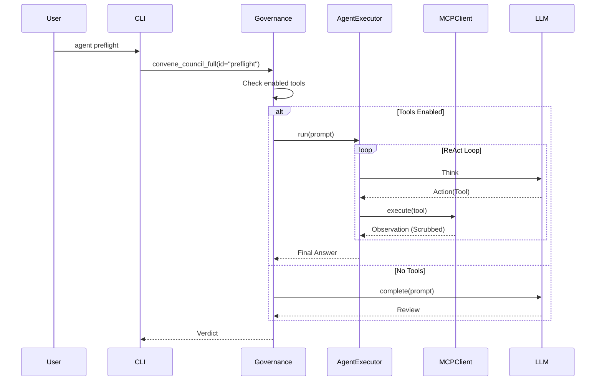

# GitHub MCP Integration

The Agent CLI now supports the [Model Context Protocol (MCP)](https://modelcontextprotocol.io/) to interact with GitHub. This allows for rich, structured interaction with repositories, issues, and pull requests directly from the agent, without requiring expensive GitHub Copilot subscriptions.

## Prerequisites

- **Node.js & npx**: Required to run the default GitHub MCP server (`@modelcontextprotocol/server-github`).
- **GitHub Personal Access Token (PAT)**: A classic PAT or Fine-grained token with `repo` and `read:org` scopes.
- **GitHub CLI (`gh`)**: Required for fallback authentication and onboarding.

## Configuration

The easiest way to configure GitHub access is via the unified onboarding command:

```bash
agent onboard
```

This command will:

1. Check for required dependencies (`git`, `gh`).
2. Prompt you for a GitHub Personal Access Token (PAT).
3. **Securely Save** it to the Agent's Secret Manager (for MCP).
4. **Authenticate** the GitHub CLI (`gh`) automatically.

### Manual Configuration

If you prefer to configure it manually:

1. **Authenticate `gh` CLI**:

   The Agent can automatically use your `gh` credentials if valid.

   ```bash
   gh auth login
   ```

2. **Or, Set Agent Secret**:

   For disconnected environments or specific agent tokens:

   ```bash
   agent secret set github token <YOUR_PAT>
   ```

## Usage

### Interactive Session

To start an interactive REPL session with the GitHub MCP server:

```bash
agent mcp start github
```

This is useful for debugging connection issues or exploring available tools interactively.

### One-off Tool Execution

To run a specific tool (useful for scripting or testing):

```bash
agent mcp run github list_repositories '{"limit": 5}'
```

### Available Tools

To list all tools exposed by the GitHub server:

```bash
agent mcp list-tools github
```

Common tools include:

- `list_repositories`
- `create_issue`
- `list_issues`
- `get_file_contents`
- `create_pull_request`

## Architecture

How the Agent Loop integrates with the Governance Council:



### Council Tool Integration

Agents in the Governance Council (e.g., `preflight`, `panel`) can be configured to use specific tools during their review. This allows them to read referenced issues or inspect file contents dynamically.

**Configuration**:
See `agent/core/config.py` for the `DEFAULT_COUNCIL_TOOLS` mapping.

- **Preflight Council**: Can read issues (`github:get_issue`).
- **Governance Panel**: Can read issues and files (`filesystem:read_file`).

The integration uses the `agent.core.mcp` package to communicate with MCP servers over `stdio`. The `github` server configuration is defined in `agent.core.config.DEFAULT_MCP_SERVERS` and uses `npx` to spawn the official `@modelcontextprotocol/server-github`.

### Authentication Strategy

The MCP client determines credentials in the following priority order:

1. **Secret Manager / Environment**: Checks `agent secret` key `github.token` or `GITHUB_PERSONAL_ACCESS_TOKEN` env var.
2. **GitHub CLI (`gh`)**: If secrets are not set or the manager is locked, retrieves the token from `gh auth token` (System Keychain).
3. **Manual Unlock**: If all else fails, prompts the user to unlock the Secret Manager.
