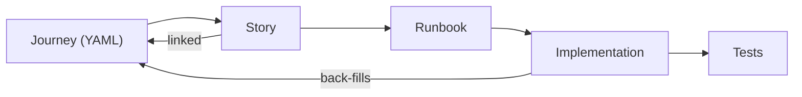

# User Journeys

User journeys are structured YAML files that describe **what your system does from a user's perspective**. They act as a behavioral contract — the agent reads them before writing code and avoids breaking them when implementing new features.

## Why Journeys Exist

Journeys are a **prerequisite for implementation**, not optional documentation. The agent will not implement a story unless the relevant user journeys are defined. This ensures every piece of generated code is traceable to a user-facing behavior.

Without journeys, the agent has no memory of existing behavior. When it implements a new story, it may modify shared files and break something that was working. Journeys solve this by giving the agent a map of:

- **Who** does something (actor)
- **What** they do (steps)
- **What should happen** (assertions)
- **Which code backs it** (implementation mapping)

## The Workflow Order

```text
Journey (define behavior) → Story (scope the work) → Runbook (plan the code) → Implement (write the code)
```



You define the journey **first**. The story references it. The runbook is generated with journey context. Implementation happens against the journey's contract. After implementation, the agent back-fills the journey's `implementation` blocks with the actual code mapping.

## The Lifecycle

```text
You write it → Story links to it → Agent codes against it → Agent fills in the code mapping → Future agents protect it
```

### Phase 1: You Create It (Before Implementation)

Run `agent new-journey` to scaffold a journey file:

```bash
agent new-journey JRN-001
```

Or use `--offline` to have the AI generate a populated journey from a brief description:

```bash
agent new-journey JRN-001
```

This creates a YAML file in `.agent/cache/journeys/`. Fill in (or review, if `--offline` was used) the required fields:

```yaml
id: JRN-001
title: "User signs up and verifies email"
state: DRAFT
actor: "unauthenticated user"

description: |
  New user creates an account and verifies their email address.

steps:
  - id: 1
    action: "User navigates to /signup"
    system_response: "Renders signup form"
    assertions:
      - "Signup form is visible"

  - id: 2
    action: "User submits email and password"
    system_response: "Creates account, sends verification email"
    assertions:
      - "HTTP 201 returned"
      - "Verification email sent"

  - id: 3
    action: "User clicks verification link"
    system_response: "Marks email verified, redirects to dashboard"
    assertions:
      - "User.email_verified == true"
      - "Redirect to /dashboard"
```

That's a complete journey. Five required fields: `id`, `title`, `actor`, `description`, `steps`.

Everything else is optional with safe defaults. Add what's useful, skip what isn't:

| Optional Field | When To Use It |
| --- | --- |
| `error_paths` | When the happy path has known failure modes (card declined, link expired) |
| `edge_cases` | When there are race conditions, idempotency concerns, or security boundaries |
| `preconditions` | When the journey depends on external state (API keys configured, user logged in) |
| `auth_context` | When the journey requires specific permissions |
| `data_state` | When you want to track what data is created or modified |
| `test_hints` | When you want the agent to generate tests in a specific framework |

### Phase 2: Story Links To It, Agent Reads It During Runbook Creation

Your story references the journey IDs that define the behavior being implemented. When you run `agent new-runbook`, the agent loads **all existing journeys** and injects them into its prompt. This means:

- The agent sees every behavioral contract before designing an implementation plan
- If your new story touches files that back an existing journey, the agent flags the overlap
- The runbook is generated with awareness of what must not break

You don't need to do anything for this step — it happens automatically once the journey exists.

### Phase 3: Agent Implements And Fills In The Code Mapping

During and after implementation, the agent populates the `implementation` block on each step, linking the journey's behavioral contract to real code:

```yaml
steps:
  - id: 1
    action: "User navigates to /signup"
    system_response: "Renders signup form"
    assertions:
      - "Signup form is visible"
    implementation:              # ← agent fills this in
      routes: ["/signup"]
      files:
        - path: "src/pages/Signup.tsx"
          type: component
        - path: "src/api/auth/signup.ts"
          type: handler
      tests:
        - "tests/e2e/signup.test.ts"
```

It also fills in the top-level summary:

```yaml
implementation_summary:
  entry_point: "/signup"
  components:
    - "src/pages/Signup.tsx"
    - "src/api/auth/signup.ts"
    - "src/services/email.ts"
  test_suite: "tests/journeys/test_jrn_001.py"
```

> **Important**: These mappings are *advisory*. The agent uses them as hints, but still scans the codebase independently. If you rename a file, the mapping goes stale — that's fine. The agent won't break because of it.

### Phase 4: Future Implementations Are Protected

This is where journeys pay off. When someone runs `agent implement` for a new story:

1. **Journey gate** — the agent reads `## Linked Journeys` from the story. If no journeys are linked, implementation is **blocked**:

   ```text
   ❌ No journeys linked to this story.
      Define journeys first with 'agent new-journey', or use --skip-journey-check to proceed.
   ```

   Use `--skip-journey-check` for infrastructure stories (CI/CD, tooling) that have no user-facing behavior.

2. **Agent loads all journeys** and their implementation mappings
3. **Detects overlap** — "this new story touches `auth/signup.ts`, which backs JRN-001 step 2"
4. **Generates code** with the constraint: "preserve JRN-001 assertions"
5. **Runs journey tests** after implementation
6. **Fixes regressions** if any journey tests fail

During `agent preflight`, overlap warnings appear:

```text
⚠️  Changed file src/api/auth/signup.ts is mapped to:
   - JRN-001 step 2: "User submits email and password"
   Recommendation: Run journey tests for JRN-001
```

## Quick Reference

### Commands

| Command | What It Does |
| --- | --- |
| `agent new-journey [ID]` | Create a new journey from template |
| `agent new-journey [ID]` | Create a journey with AI-generated content |
| `agent list-journeys` | Show all journeys with ID, title, state |
| `agent validate-journey` | Check YAML is valid against schema |

### File Location

Journeys live in `.agent/cache/journeys/` as YAML files.

### Minimal Journey (Copy-Paste Starter)

```yaml
id: JRN-001
title: "User logs in"
actor: "registered user"
description: "User authenticates with email and password."
steps:
  - action: "User submits credentials"
    system_response: "Returns session, redirects to dashboard"
    assertions:
      - "HTTP 200"
      - "Session cookie set"
```

### Full Field Reference

- **[Journey YAML Schema Spec](journey_yaml_spec.md)** — complete field reference with types, defaults, and examples
- **[ADR-024](../adrs/ADR-024-introduce-user-journeys.md)** — architectural decision record
- **`.agent/templates/journey-template.yaml`** — copy-paste starter template with inline comments
