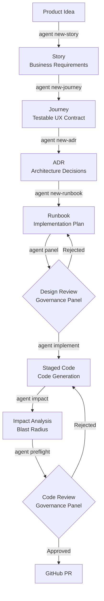

# Engineering Discipline in the Age of AI: The End of "Vibe Coding"

The rise of generative AI has fundamentally altered how code is written. But amidst the breathtaking demos of applications conjured from single prompts, a dangerous new anti-pattern has emerged: "vibe coding."

Vibe coding is the reliance on unstructured prompts, massive context windows, and iterative guessing without formal engineering rigor. It feels fast in the beginning, but it fundamentally breaks down at the enterprise scale. To harness the true power of Large Language Models (LLMs) in software engineering, we must stop treating them as omniscient oracles and start managing them as highly capable, yet easily distracted, junior developers.

This is where **`agentic-dev`** comes in.

## 1. The Crisis of "Vibe Coding"

Vibe coding occurs when an engineer dumps an entire codebase into an LLM, types a vague prompt like "add a user profile page," and blindly accepts the resulting diff.

### The Context Stuffing Trap

The core fallacy of vibe coding relies on "context stuffing." The assumption is that if an LLM has a million-token context window, it can reason over the entire application simultaneously. This leads to **cognitive overload**. As the context window swells, the AI's attention span degrades. It begins to ignore critical constraints, hallucinate dependencies, and overwrite unrelated logic.

### The Fallout

In a probabilistically driven system, relying solely on context stuffing guarantees a lack of deterministic outcomes. The immediate fallout includes:

- **Silent Regressions**: The LLM successfully implements a new feature but unknowingly breaks a bespoke authentication flow it "forgot" about midway through its response.
- **Architectural Decay**: Without bounded rules, the LLM will take the path of least resistance, bypassing service layers or mixing frontend code into backend APIs.
- **Unverifiable PRs**: Human reviewers are overwhelmed by massive, undocumented diffs generated in seconds.

AI coding requires *more* discipline and *curated context*, not less. LLMs must be wrapped in standard engineering boundaries.

## 2. The Solution: `agentic-dev`

`agentic-dev` is a deterministic framework that treats AI as a suite of highly constrained virtual developers. Instead of one massive prompt, it breaks the Software Development Lifecycle (SDLC) into discrete, verifiable agentic workflows.

### Provider Agnosticism

Vendor lock-in is a massive risk in the fast-moving AI landscape. `agentic-dev` abstracts the LLM layer entirely. This allows teams to seamlessly swap between Google Gemini, OpenAI, Vertex AI, Anthropic, and GitHub Models depending on the task's specific latency, reasoning, or privacy requirements.

### Core Philosophy

1. **Workflows are Instructions**: If a human can follow it, an agent can automate it.
2. **Governance is Code**: Security, compliance, and architectural rules are not suggestions; they are hardcoded markdown rules that physically block pull requests if violated.

## 3. Architecture Breakdown: The Lifetime of Software

In the `agentic-dev` ecosystem, the source of truth is moved away from the raw Python or TypeScript files and back to standard Markdown and YAML.

- **Natural Language as Code (NLaC)**: Business features are defined as **Stories**, technical blueprints as **Runbooks**, and decisions as **ADRs** (Architecture Decision Records). These documents act as the literal compiler inputs for the AI.
- **Context Curation (The Antidote to Vibe Coding)**: `agentic-dev` acts as a governor that actively *restricts* the AI's context window. By feeding the implementing LLM only the scoped Runbook, the specific Story, and the explicitly relevant Rules, the system maximizes the AI's reasoning capabilities and attention span.
- **Rules (`.agent/rules/`)**: Hard boundaries for LLM creativity. If a rule says "All configuration must use environment variables," the AI cannot bypass it.
- **Agent Roles**: The system operates via a multi-agent Governance Panel. Roles like `@Architect`, `@Security`, and `@QA` provide parallel, expert reviews of staged code before a human ever looks at it.

### The Agentic Workflow Pipeline

Here is how these verified artifacts feed into the implementation pipeline:

## 4. Deep Dive: Journeys and the War on Regressions

The greatest threat in AI-assisted development is the "Context Window Fallacy" — the fact that an AI forgets the specific intricacies of the user experience as the codebase grows.

`agentic-dev` solves this through **User Journeys**.

Journeys are YAML/Markdown contracts (stored in `.agent/cache/journeys/`) representing critical paths through the application (e.g., "User resets their password").

This introduces the **Journey Gate**. The CLI strictly refuses to allow an AI to implement new code if a User Journey isn't linked to the current Story. By anchoring the acceptance criteria to a physical YAML contract, the system ensures that as the AI modifies code, it is continuously modeling its changes against the established Journeys. These Journeys then automatically map to and regenerate End-to-End tests, mathematically ensuring the UX contract is never broken.

## 5. Final Demo: Exploiting the Full AI Assembly Line

To understand the mature toolchain `agentic-dev` provides, let's walk through an end-to-end feature resolution, from initialization to Pull Request.

1. `agent onboard` & `agent config`
   - **Action**: Initializes the repository for the Agentic workflow, bootstrapping schemas and provider selection.
   - **Value**: Instant organizational standardization.

2. `agent mcp list`
   - **Action**: Connects external Model Context Protocol (MCP) servers (like NotebookLM or corporate Notion).
   - **Value**: Prevents hallucinations by feeding the AI accurate, real-time organizational knowledge.

3. `agent new-story`
   - **Action**: The CLI interviews the product manager and captures business requirements into a Markdown file.
   - **Value**: Traceability. The AI now has a verified goal.

4. `agent new-journey <STORY_ID>`
   - **Action**: Distills the story's acceptance criteria into a specific YAML test contract.
   - **Value**: Halts future regressions by memorializing the UX path.

5. `agent new-adr <STORY_ID>`
   - **Action**: Documents significant architectural decisions and forces justification mapping against the Story.
   - **Value**: Establishes required architectural compliance *before* an implementation plan is drawn up.

6. `agent new-runbook <STORY_ID>`
   - **Action**: Generates an architectural implementation plan outlining the exact files to modify.
   - **Value**: Aligns implementation with approved design.

7. `agent panel`
   - **Action**: Convening the AI Governance Panel *during* the design phase for expert feedback on the runbook.
   - **Value**: Catches architectural flaws before engineers spend time coding.

8. `agent implement <RUNBOOK_ID>`
   - **Action**: AI writes the code against the verified runbook and impact analysis.
   - **Value**: High-velocity, highly constrained generation that avoids context stuffing.

9. `agent impact --base main`
   - **Action**: AI-powered risk assessment that scans dependencies and models regressions against uncommitted staged changes.
   - **Value**: Demonstrates the mature toolchain by computing blast-radius damage of the newly generated code *before* code review.

10. `agent validate-story` & `agent lint`
    - **Action**: Static enforcement of the Story structure and syntax rules.
    - **Value**: Guaranteed clean, conformant code.

11. `agent preflight`
    - **Action**: The full Governance Panel scrutinizes the staged changes against security, QA, and compliance rules.
    - **Value**: Automated, exhaustive, and uncompromising code review.

12. `agent visualize flow`
    - **Action**: Generates Mermaid diagrams of the new architecture.
    - **Value**: Effortless visual documentation for the team.

13. `agent pr`
    - **Action**: Formats conventional commits and pushes the branch.
    - **Value**: Merging verified, tested, and compliant code effortlessly.

## 6. Tradeoffs and Considerations

While `agentic-dev` provides extreme rigor, it is not a silver bullet. Adopting this framework comes with distinct tradeoffs:

- **The Learning Curve**: Moving from "vibe coding" in a chat UI to a CLI-driven, multi-stage pipeline requires a mental shift. Developers must learn to write explicit Markdown Stories and YAML Journeys instead of just asking an AI to "figure it out."
- **Verbosity**: The framework generates heavily documented traces (Runbooks, ADRs, Governance Logs). While incredible for compliance and debugging, this verbosity can feel like overhead for trivial, single-line bug fixes.
- **Provider Reliance**: Though provider agnostic, the system still fundamentally relies on the uptime and latency of third-party LLM APIs. If the chosen provider experiences an outage, the automated governance pipeline halts until you switch providers with `--provider`.

## 7. Conclusion

The era of typing vague prompts into chat boxes and hoping for the best is over. Enterprise-grade AI development requires rigid pipelines, curated context, and programmatic governance. The future of software engineering is managing AI agents, curating their context boundaries, and enforcing deployment policies.

With `agentic-dev`, that future is available today.
